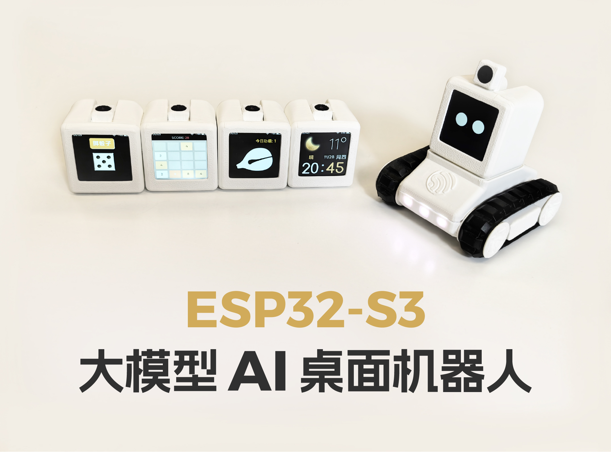
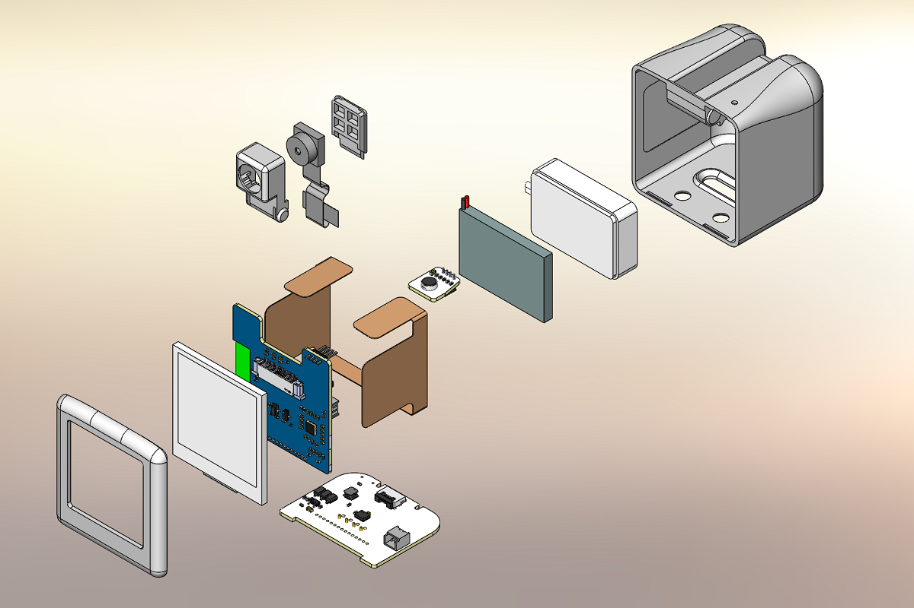
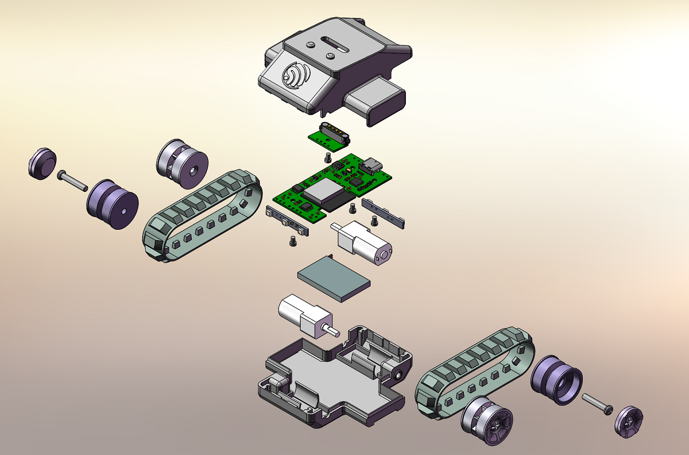
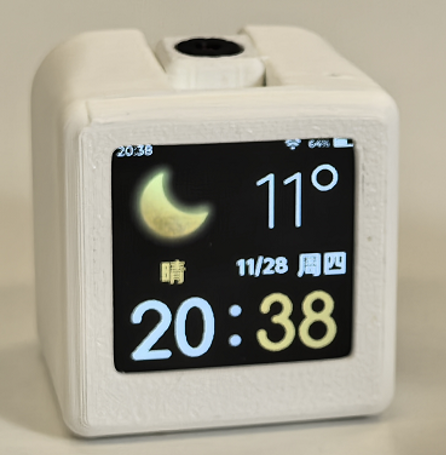
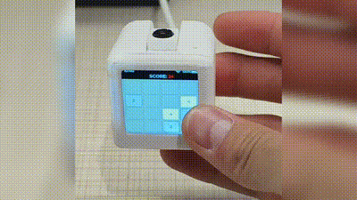
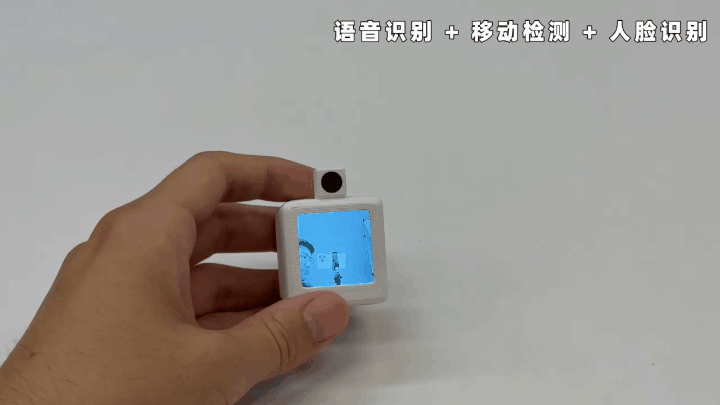
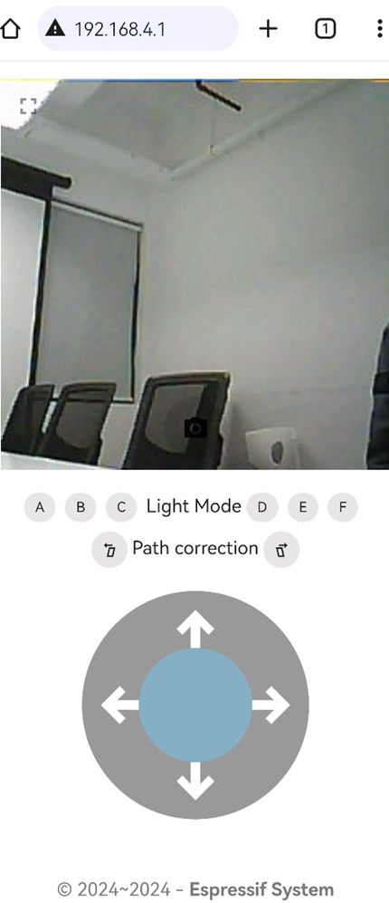

# ESP-SparkBot: ESP32-S3 大模型 AI 桌面机器人

## **项目简介**

ESP-SparkBot 是⼀款基于 **ESP32-S3**，集成语⾳交互、图像识别、遥控操作和多媒体功能于⼀体的智能设备。它不仅可以通过语⾳助⼿实现**⼤模型对话**、天⽓查询、⾳乐播放 等互动，还支持使⽤**⼩度⼿机 APP** 完成蓝牙配⽹、⾳⾊切换、⾳乐播放及其他智能服务。同时，ESP-SparkBot **内置加速度传感器**，⽀持摇⾊⼦和 2048 游戏等娱乐交互功能。硬件⽅⾯，其磁吸式设计⽀持模块扩展，可轻松转换为遥控⼩⻋，实现**摄像头实时传输**和**⼿机操控**。此外，设备⽀持本地 AI 处理，可以运⾏**⼈脸识别和动作检测**功能。还可以通过投屏模块实现⾼清视频播放和游戏运⾏，展⽰强⼤的性能和多功能性。

## 视频展示

[ESP32 大模型 AI 桌面机器人](https://www.bilibili.com/video/BV1MezzYaEfP/?spm_id_from=333.1365.list.card_archive.click&vd_source=e731e982043e3ccbb2c03395e0a66c39)

**也欢迎大家二次开发，一起感受 ESP-SparkBot 的魅力与乐趣**

## 软件资源

目前已开放部分代码例程，请参考 [example 文件夹](example)，后续会持续升级更新

## 硬件设计

硬件已开源在**立创平台**：[ESP-SparkBot](https://oshwhub.com/esp-college/esp-sparkbot)

## **3D 结构设计**

- **3D 打印文件已开放附件**，欢迎下载！
    - [ESP-SparkBot](3D_Print/ESP_SparkBot)
    - [履带小车](3D_Print/Tank)
    - [充电底座](3D_Print/Dock)

- **主体结构**

    ESP-SparkBot 的主体结构炸视图如下：

    

    
    

    如图所示，主体的一共有 **3 块 PCB** 板，都通过 1.27 mm 的排针排母进行对接。其中，竖着的**核心 PCB 板**上有 ESP32-S3 的模组、屏幕驱动电路及接口、摄像头驱动电路及 FPC 接口、ES8311 音频电路及扬声器接口。由于受结构影响，**麦克风单独贴装在一块小的 PCB 板**，它与主控板之间通过 4P 1.27 mm 的排针排母进行对接。横着的**底部 PCB 板**上搭载了 USB-Type-C 口、BMI270 陀螺仪、5V-3.3V DC-DC 转换电路、锂电池充电管理电路及接口、4P 磁吸连接器（母）。竖着的核心 PCB 板和横着的主体 3D 结构由**四部分组成**，分别是**主体后壳、主体前盖（带屏幕卡口）、摄像头前盖和摄像头后盖**。

- **履带小车底盘结构**

    ESP-SparkBot 的履带小车底盘结构炸视图如下：

    

    
    

    如图所示，履带小车底盘由**两个 N20 减速电机、ESP32-C2 主控 PCB 板、前后 RGB 灯板、4P 磁吸连接器板、锂电池、两个橡胶履带和 3D 打印结构**组成。左右两侧履带分别由两个 N20 减速电机进行驱动，3D 结构设计上主动轮设计有**牙槽**，防止打滑。

## **交互方式**

    ESP-SparkBot 使用 ESP32-S3 自带的触摸功能进行交互，触摸按键通过 FPC 软排线粘贴在 ESP-SparkBot 的顶部（注意：由于受到摄像头结构的影响，顶部按键被分割为左右两块，实际两个按键串接在同一个触摸引脚上）及两个侧面，默认情况下，顶部按键用于确认，左右两侧按键用于功能切换。

## **功能展示**

- **天气时钟功能**

    ESP-SparkBot 可以通过 IP 地址显⽰当地的实时⽇期、天⽓和温度。

- **大模型 AI 对话功能**

    ESP-SparkBot 可以通过接入大语言模型，实现对话聊天功能，如：文心一言、火山引擎、OpenAI 等。

    

    
    

- **蓝牙音箱功能**

    在⼿机端可以通过**⼩度 APP** 进⾏蓝牙配⽹和互动操作。连接到⼩度服务器后，ESP-SparkBot 能直接语⾳控制家中的⼩度智能设备，成为你的**全能语⾳助⼿**。

    ESP-SparkBot 不仅⽀持⾳量调节，还可以**切换到特定的播报⾳⾊**，比如明星配⾳。

    通过绑定 QQ ⾳乐账号，ESP-SparkBot 还能**播放你喜欢的⾳乐**，瞬间化⾝为⼀台**迷你⾳箱**。还⽀持播放新闻和有声读物，让⽤户体验更加丰富多彩。

- **赛博木鱼功能**

    在木鱼功能界面，通过触摸 ESP-SparkBot **顶部的触摸按键**，可以敲赛博⽊⻥，积累功德。
    如果⼿中有很多 ESP-SparkBot，可以通过 **ESP-NOW** ⼴播同时敲⽊⻥。成倍积累功德。
    功德圆满后进入放松摸⻥状态。

    

    
    

- **赛博骰子功能**

    ESP-SparkBot 内置加速度传感器，进而可以将它当作⼀个赛博骰子，随机转到或摇晃 ESP-SparkBot，屏幕中的 3D 骰子就会根据加速度传感器数据进行转动，停止转到或摇晃后，屏幕上的骰子会逐渐停止转到，并显示最终的骰子点数。

- **2048 游戏功能**

    ESP-SparkBot 也搭载了 2048 游戏，进入到 2048 游戏界面后，通过内置的加速度传感器可实现手势识别，通过手势动作与游戏进行交互，畅玩 2048，触摸顶部触摸按键可重置 2048 游戏。

    

        
        

- **语音识别 & 人脸识别 & 移动检测**

    ESP32-S3 ⽀持在本地离线运⾏⼀些 AI 模型，比如语⾳识别、⼈脸识别和移动检测。

    通过使用 [ESP-SR](https://github.com/espressif/esp-sr) 库，可以轻松在本地实现语音识别。

    通过使用 [ESP-WHO](https://github.com/espressif/esp-who) 库，可以轻松实现其他视觉 AI 模型，比如猫脸识别、人脸识别、移动检测和⾏⼈检测等。

    

    
    

- **USB 投屏功能**

    ESP-SparkBot 还可以通过 USB 进⾏投屏，仅需⼀根 USB 线即插即⽤，不占⽤ HDMI ⼝，可以轻松把它当作⼀个电脑副屏使⽤。

    ⽀持⾳频双向传输，既可以当作扬声器，也可以当作麦克⻛。除了可以流畅观看电视剧，还可以流畅体验电竞或者 3A ⼤作。

    

    
    

    

    
    

- **运动控制和无线图传功能**

    除了以上功能，ESP-SparkBot 可以作为一个无线遥控侦查机器人使用。

    ESP-SparkBot 底部设计有 4P 磁吸接口（5V/GPIO48/GPIO38/GND），通过设计一个履带小车底盘（需单独再使用一个其他主控，本工程使用的是 ESP32-C2），将履带小车底盘的 4P 磁吸接口与 ESP-SparkBot 的 4P 磁吸接口连接，履带底盘除了可以通过 5V 和 GND 引脚为 ESP-SparkBot 供电，还可以将另外两个 GPIO 通过程序配置为其他通信协议引脚（比如 UART和 I2C），实现履带底盘和 ESP-SparkBot 的数据通信。本项目使用 UART 通信协议，由 ESP-SparkBot 给履带底盘主控发送控制命令，进而实现运动控制。

    在运动控制上，可以使用语音控制它前进后退和左右转，或者通过无线遥控设备进行控制。对于无线遥控端，本项目设计开发了配套的 WebServer 控制界面，通过连接到 ESP-SparkBot 的 WebSocket 服务器，然后使用浏览器（推荐使用 Chrome 浏览器）打开 **WebServer 控制界面（192.168.4.1）**就能实现机器人的运动控制和无线图传，另外还可以拍照和切换灯光效果。

    语音控制小车运动：

    

    
    

    WebServer 控制界面：

    

    
    

