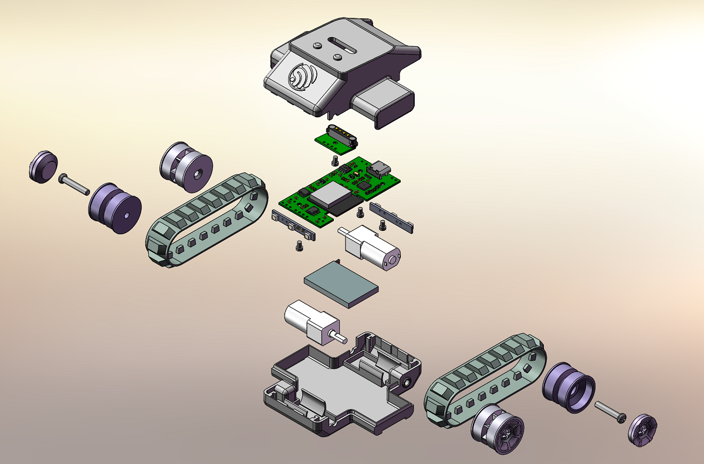

# ESP-SparkBot 作为小车主控

ESP-SparkBot 底部设计有 4P 磁吸接口（5V/GPIO48/GPIO38/GND），可以将履带小车底盘的 4P 磁吸接口与 [ESP-SparkBot](../sparkbot_motion_control/) 的 4P 磁吸接口连接。本项目使用 UART 通信协议，由 ESP-SparkBot 给履带底盘主控发送控制命令，进而实现运动控制。

# 硬件结构

    
    

如图所示，履带小车底盘由**两个 N20 减速电机、ESP32-C2 主控 PCB 板、前后 RGB 灯板、4P 磁吸连接器板、锂电池、两个橡胶履带和 3D 打印结构**组成。左右两侧履带分别由两个 N20 减速电机进行驱动，3D 结构设计上主动轮设计有**牙槽**，防止打滑。

- 3D 建模请参考：[3D_Print/Tank](../../../3D_Print/Tank)
- PCB 请参考：[立创开源](https://oshwhub.com/esp-college/esp-sparkbot)