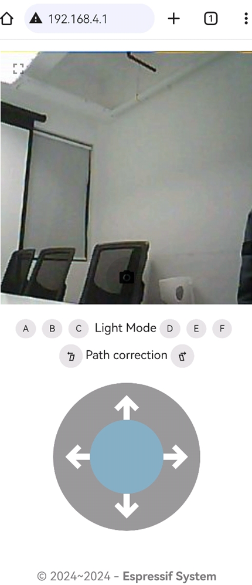

# ESP-SparkBot 作为小车主控

ESP-SparkBot 底部设计有 4P 磁吸接口（5V/GPIO48/GPIO38/GND），可以将[履带小车底盘](../c2_tracked_chassis/)的 4P 磁吸接口与 ESP-SparkBot 的 4P 磁吸接口连接。本项目使用 UART 通信协议，由 ESP-SparkBot 给履带底盘主控发送控制命令，进而实现运动控制。

## 语音控制小车

<div align="center">
    
    </div>

使用 “Hi 乐鑫” 唤醒小车，唤醒后可持续语音控制小车，目前支持指令：

```
向前冲
先后退
向左转
向右转
跳个舞

长亮模式
呼吸模式
闪烁模式
灯光秀
```

唤醒一段时间后，若没有收到命令词，则会退出语音控制模式等待唤醒。

## 手机控制小车

通过连接到 ESP-SparkBot 的 WebSocket 服务器（手机或电脑连接 Wi-Fi: esp-sparkbot），然后使用浏览器（推荐使用 Chrome 浏览器）打开 **WebServer 控制界面（192.168.4.1）** 就能实现机器人的运动控制和无线图传，另外还可以拍照和切换灯光效果。

<div align="center">
    
    </div>
